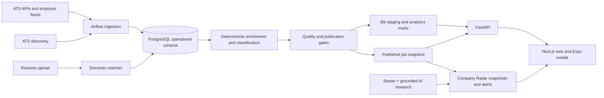

# Lander data platform

[](https://github.com/lukejones3/job-market-analytics/actions/workflows/verify.yml)

**Direct-source job intelligence built for job seekers.**

[Lander](https://www.landerjob.com) collects openings from company applicant
tracking systems, turns the raw postings into a governed labor-market dataset,
and serves the resulting job, company, salary, skill, and posting-quality
intelligence through a FastAPI service.

This repository owns Lander's backend and data plane: source discovery,
ingestion, enrichment, classification, quality gates, publication, analytics
marts, semantic resume matching, and the API. The user-facing Next.js and Expo
applications live in the separate
[`lander`](https://github.com/lukejones3/lander) repository.

## What is in production

- Direct ingestion from 12 ATS ecosystems: Greenhouse, Lever, Ashby, Workday,
  Eightfold, Amazon Jobs, SmartRecruiters, Workable, iCIMS, Taleo, Jobvite, and
  BambooHR.
- Continuous ATS-tenant discovery, validation, health tracking, and activation.
- Opt-in coverage adapters for USAJOBS, employer JSON/CSV feeds, career-page
  `JobPosting` JSON-LD, and an explicitly Tier 2 Adzuna backstop.
- Deterministic salary extraction and annualization, role/domain/experience
  classification, skill extraction, location normalization, and company identity
  resolution.
- Source-level lifecycle tracking, cross-source deduplication, canonical
  opportunity grouping, stale-post expiry, and fail-closed publication gates.
- Ghost-job probability, honesty scores, hiring difficulty, salary benchmarks,
  company scorecards, market coverage, and skill-demand marts.
- Resume parsing and semantic job matching with `all-MiniLM-L6-v2`, PostgreSQL
  `pgvector`, and HNSW indexes.
- Public market and editorial-insight endpoints plus authenticated job,
  company, market, resume, account, and billing APIs.

The production dataset changes after each successful publication. Lander's live
counts are computed from the same public-feed boundary used by the product,
rather than copied into this README as a quickly stale snapshot.

## Company Radar data plane

The checked-in Company Radar pipeline turns retained posting lifetimes and
verified lifecycle events into a 45-day launch history, then records exact live
daily observations. It operates on stable company IDs and canonical
opportunities, retains zero-opening companies, and excludes crawler churn and
bulk ATS refresh cohorts from repost signals. User follows feed an in-app alert
inbox plus idempotent daily or weekly Resend digests.

External research is a separate non-critical DAG. Serper supplies source URLs
and snippets; optional OpenAI structured output may compress that evidence, but
the deterministic classifier remains authoritative and every displayed brief
keeps its source URL. Research failure cannot block ingestion or publication.

## System architecture



PostgreSQL is both the operational store and analytics warehouse. Base tables
in `public` hold source records and normalized entities; dbt builds staging
views and analytics tables in the `analytics_*` schemas. Publication is an
explicit boundary: a failed crawl or quality gate cannot silently expire the
currently published job set.

The scheduled enrichment path is intentionally LLM-free. Production
classification uses versioned taxonomies, SQL, regexes, heuristics, and cached
labels so nightly correctness and cost do not depend on a model API.

## Production orchestration

Airflow 3 with `LocalExecutor` is the checked-in production scheduler.

| DAG | Schedule (UTC) | Responsibility |
|---|---:|---|
| `lander_nightly` | `05:00` daily | Backup, ingest all ATS sources, gate, enrich, classify, deduplicate, expire, build dbt, publish, refresh SEO, and report |
| `lander_ats_discovery_daily` | `11:00` daily | Broad-domain discovery plus stale-candidate validation and activation |
| `lander_ats_discovery` | `12:00` Sunday | Full ATS and Common Crawl/Workday discovery, validation, integration, and health reporting |
| `lander_resume_embeddings` | Every 5 minutes | Embed newly uploaded resumes without overlapping workers |
| `lander_company_radar_research` | `14:00` daily | Refresh sourced evidence for followed/high-momentum companies and deliver idempotent Radar digests |
| `lander_shadow_validation` | Manual | Read-only production environment and database validation |

The nightly DAG records a crawl outcome for every source and waits for all
source tasks before evaluating the ingest quality gate. Downstream mutation,
expiry, dbt, and publication only proceed after their dependencies succeed.
Concurrency is deliberately bounded to protect the API and PostgreSQL on the
production host.

The DAG definitions are in [`airflow/dags`](airflow/dags), with deployment notes
in [`airflow/README.md`](airflow/README.md).

## API surface

The application entry point is `python.api:app`.

### Public and system endpoints

| Method | Path | Purpose |
|---|---|---|
| `GET`, `HEAD` | `/health` | Service health |
| `GET`, `HEAD` | `/v1/public/market` | Live public-feed counts and a recent-job preview |
| `GET`, `HEAD` | `/v1/public/insights/{slug}` | Allow-listed editorial data products |

Public aggregate queries have bounded statement timeouts, rate limiting, and
explicit shared-cache policies. All other responses default to `no-store`.

### API-key endpoints

Authenticated clients send their credential in the `X-API-Key` header. Keys
are stored as hashes and have tier-specific daily request limits.

- `GET /v1/me`
- `GET /v1/market/overview`
- `GET /v1/market/roles`
- `GET /v1/market/skills`
- `GET /v1/market/sectors`
- `GET /v1/market/ghost-index`
- `GET /v1/companies`
- `GET /v1/companies/{slug}`
- `GET /v1/companies/{slug}/roles`
- `GET /v1/companies/{slug}/skills`
- `GET /v1/roles`
- `GET /v1/roles/{job_id}`
- `POST /v1/resume/upload`

The service also contains the magic-link authentication and Stripe subscription
routes consumed by the Lander applications. Interactive OpenAPI documentation
is disabled by default; set `EXPOSE_API_DOCS=1` to expose `/docs` and
`/openapi.json` in a trusted environment.

## Repository map

| Path | Responsibility |
|---|---|
| `python/ingest_jobs.py` | Unified ATS ingestion CLI and source crawl accounting |
| `python/*_harvest.py` | Source-specific adapters and reliability logic |
| `python/discover_*`, `python/validate_*`, `python/integrate_*` | ATS tenant discovery lifecycle |
| `python/enrich_job_postings.py`, `python/extract_*`, `python/classify_*` | Deterministic enrichment and classification |
| `python/publish_snapshot.py`, `python/airflow_quality_gate.py` | Publication boundary and quality enforcement |
| `python/api.py` | FastAPI application, authentication, billing, and resume upload |
| `python/resume/` | Resume parsing, skill extraction, matching, and gap analysis |
| `python/company_radar_research.py`, `python/company_radar_notify.py` | Sourced company-event research and Radar digest delivery |
| `airflow/dags/` | Production DAGs |
| `dbt/job_analytics_dbt/` | Staging models, marts, tests, and PostgreSQL profile |
| `config/` | Versioned role, domain, skill, discovery, and scope taxonomies |
| `sql/` | Operational schemas, views, indexes, and data-platform migrations |
| `scripts/` | Operator diagnostics, recovery, backfill, and batch helpers |
| `deploy/` | Hardened systemd units and worker definitions |
| `tests/`, `python/test_*.py`, `airflow/tests/` | API, pipeline, classifier, parser, and DAG regression suites |

## Local development

### Prerequisites

- Python 3.12
- PostgreSQL 16 with the `vector` extension
- A PostgreSQL database containing the Lander operational schema and reference
  data

This is the production data-platform repository, not a self-contained sample
application. It does not include a production database dump or a one-command
database bootstrap. Files under `sql/` evolve operational structures; dbt owns
the derived analytics layer.

### Install

```bash
git clone https://github.com/lukejones3/job-market-analytics.git
cd job-market-analytics
python3.12 -m venv .venv
source .venv/bin/activate
python -m pip install --upgrade pip
pip install -r requirements.lock
cp .env.example .env
```

Populate `.env` with database credentials and the integrations needed for the
component you are running. Never commit that file.

### Run the API

```bash
set -a
source .env
set +a
EXPOSE_API_DOCS=1 python -m uvicorn python.api:app \
  --host 127.0.0.1 --port 8000 --reload --no-server-header
```

```bash
curl --fail http://127.0.0.1:8000/health
```

The checked-in production unit also binds to loopback; Nginx and Cloudflare are
the only public ingress path.

### Common data commands

Ingestion is a dry run unless `--apply` is present:

```bash
python python/ingest_jobs.py --source greenhouse
python python/ingest_jobs.py --source greenhouse --apply
python python/ingest_jobs.py --source all --orchestration-run-id manual-$(date +%Y%m%d)
```

Optional coverage adapters follow the same dry-run/apply convention:

```bash
python python/coverage_ingest.py usajobs --apply
python python/coverage_ingest.py adzuna --apply
python python/coverage_ingest.py jsonld \
  --sitemap https://example.com/jobs-sitemap.xml --apply
python python/coverage_ingest.py feed \
  --url https://employer.example/jobs.json --apply
```

USAJOBS requires `USAJOBS_API_KEY` and `USAJOBS_EMAIL`; Adzuna requires
`ADZUNA_APP_ID` and `ADZUNA_APP_KEY`. Set `EMPLOYER_FEED_TOKEN` for a
Bearer-authenticated employer feed. JSON feeds may use a top-level array or a
`{"jobs": [...]}` object; CSV feeds require stable job/requisition IDs and the
standard job fields.

Build and test the analytics layer with the environment-backed dbt profile:

```bash
cd dbt/job_analytics_dbt
dbt deps
dbt build --profiles-dir .
```

## Configuration

| Variable | Used for |
|---|---|
| `PGHOST`, `PGPORT`, `PGDATABASE`, `PGUSER`, `PGPASSWORD` | PostgreSQL connectivity |
| `LANDER_INTERNAL_API_KEY` | Trusted server-to-server calls from the web application |
| `LANDER_BASE_URL` | Auth links and application redirects |
| `LANDER_CORS_ORIGINS` | Comma-separated browser origin allow-list |
| `LANDER_MOBILE_AUTH_CALLBACK_ALLOWLIST` | Optional exact mobile callback allow-list beyond `lander://auth/verify` |
| `STRIPE_SECRET_KEY`, `STRIPE_WEBHOOK_SECRET`, `STRIPE_PRICE_ID` | Subscription checkout, portal, cancellation, and webhooks |
| `RESEND_API_KEY`, `RESEND_FROM` | Authentication and operations email |
| `SERPER_API_KEY` | ATS tenant discovery |
| `PRELOAD_RESUME_MODEL` | Preload the semantic model at API startup; defaults to `1` |
| `PUBLIC_QUERY_STATEMENT_TIMEOUT_MS` | Anonymous aggregate query timeout; defaults to `10000` |
| `EXPOSE_API_DOCS` | Enable `/docs` and `/openapi.json`; defaults to `0` |
| `GOOGLE_INDEXING_SERVICE_ACCOUNT_JSON` or `GOOGLE_APPLICATION_CREDENTIALS` | Google Indexing API notifications |

See [`.env.example`](.env.example) for the core production variables. Individual
maintenance and coverage tools may require additional integration-specific
credentials.

## Verification

CI installs the fully resolved Python 3.12 environment from
`requirements-ci.lock` and runs the same checks below:

```bash
pip install -r requirements-ci.lock
python -m compileall -q python tests airflow
ruff check python tests airflow
pip-audit -r requirements.lock
pytest
```

The test suite covers all three test roots declared in `pyproject.toml`:
`python/`, `tests/`, and `airflow/tests/`. Add regression fixtures beside the
component they exercise; do not rely on a filename-specific CI workflow.

## Deployment

Production runs on Linux with PostgreSQL, Airflow 3, Nginx, and systemd. The API
unit in [`deploy/systemd/jma-api.service`](deploy/systemd/jma-api.service) runs a
single loopback-only Uvicorn worker with an explicit memory envelope and systemd
sandboxing. Public aggregate responses use a PostgreSQL-backed shared cache with
an in-process fallback; apply [`sql/api_response_cache.sql`](sql/api_response_cache.sql)
when provisioning the API schema.

Operational changes should preserve three invariants:

1. source failures cannot masquerade as legitimate empty crawls;
2. expiry cannot run before ingestion and publication quality gates pass; and
3. the API cannot bypass the reverse proxy or expose private responses to shared
   caches.

## License and contact

Copyright © 2026 Luke Jones. Source-available for viewing and education; see
[`LICENSE`](LICENSE) for the full terms. Commercial use, redistribution, and
derivative works require written permission.

Built by [Luke Jones](https://www.linkedin.com/in/luke-j-78a02121b). Product and
security contact: [luke@landerjob.com](mailto:luke@landerjob.com).
